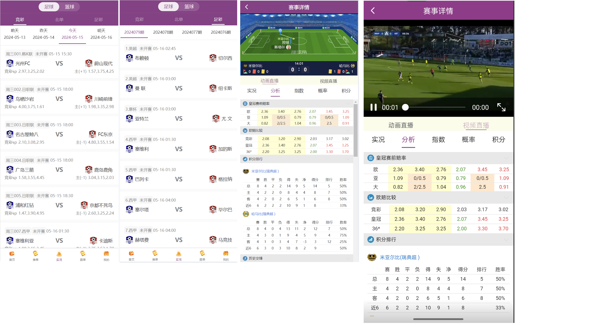
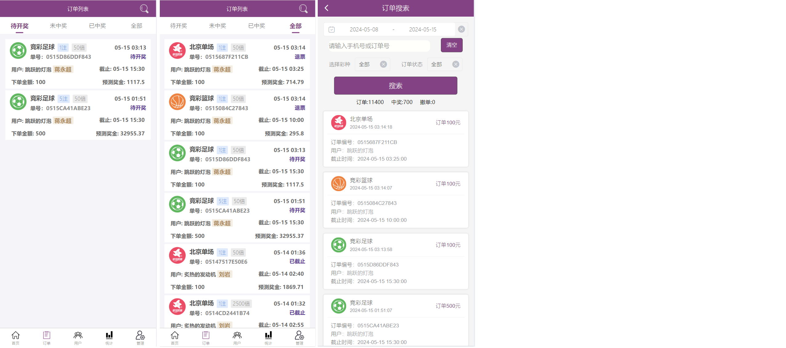

# 体彩项目简介  
本项目为线上体育彩票app，可开启关闭购彩功能，开启关闭出票功能。同时满足体育赛事预测与线下实体店线上售彩等需求。  
项目因团队分歧原因停止运营，源码出售中  
### 需要请联系telegram：@dv_zs    
本系统由用户端app、店主端app、和管理后台三个的项目组成：
### 1.用户端
后端采用spring boot框架开发，前端使用uniapp框架开发  
* 项目已完成的功能包括但不限于：  
    0.用户短信验证码注册，登录，修改密码  
    1.支持用户购彩，M串N，发单跟单，奖金优化  
    2.店主发送公告，中奖信息轮播  
    3.爬取推单文章，可设置免费或付费观看  
    4.比赛实时比分展示，爬取动画直播和视频直播  
    5.用户跟单，跟单列表由后台机器人自动发布高中低三种赔率的二串一订单，管理后台可手动添加已过期比赛的跟单，控制用户跟单排名，用户分享跟单内容  
    6.支持当面付，第三方支付，店主二维码充值，支持支付宝银行卡提现，邀请好友统计，交易明细，投注记录，红包等      
    7.app更新已去除uniapp对云函数的依赖，更新接口在后端独立完成

整体效果如下（部分打码）：  
  
用户购彩：  
  
推单文章（部分打码）：  
  
实况部分：
  
跟单部分：
  
个人中心：
  
### 2.店主端
后端采用spring boot框架开发，前端使用uniapp框架开发
* 项目已完成的功能包括但不限于：  
    0.店主绑定微信公众号，用户下单与出票即将超时，公众号推送通知消息  
    1.用户充值和用户注册时，在首页通知，方便店主第一时间联系用户  
    2.店主发送静态公告和弹窗公告  
    3.设置重点用户，代理用户，添加线下用户，发起线下用户收款  
    4.统计注册人数，下单人数，出票金额，派奖金额等  
    5.支持当面付，第三方支付，店主二维码充值，支持支付宝银行卡提现，邀请好友统计，交易明细，投注记录，红包等      
    6.批量接单，出票，批量派奖，确认提现等    
    7.app更新已去除uniapp对云函数的依赖，更新接口在后端独立完成

整体效果如下（部分打码）：  
  
订单部分：  
  
用户部分：  
  
<!-- 统计部分：
   -->
管理部分：
  
  
### 3.管理端
后端采用spring boot框架开发，前端使用vue开发
* 项目已完成的功能包括但不限于：  
    0.用户管理，用户昵称手机号搜索，手动添加用户  
    1.发单机器人管理，创建发单机器人，可设置发单类型，赔率，发单数量，每日8点开始陆续自动发单和自动跟单    
    2.手动添加虚拟账户，创建已开奖的跟单，用于制作虚拟跟单排名，确保随时有连红的发单账户  
    3.设置域名和下载地址，app前端地址，配置更新版本  
    4.详细的流水订单与彩票订单详情  
    5.添加加盟店，处理用户申请加盟消息      
    6.新增支付通道，手动开启关闭系统支付通道，店铺支付通道    
    7.新增推单作者与推单文章，管理员可自行编写推单文章，也可以自动爬取推单文章  

首页部分:  
  
机器人：  
  
发单：  
  
流水：  
  
彩票：
  
支付：
  
文章：
  
